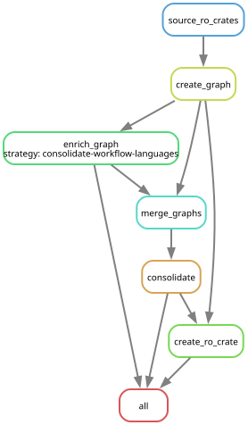

# WorkflowHub Knowledge Graph

A tool to generate a knowledge graph from a source of RO Crates. By default, this tool sources and generates an RDF graph of crates from [WorkflowHub](https://workflowhub.eu/). 

[](https://github.com/workflowhub-eu/workflowhub-graph/actions/workflows/push-docker.yaml)
[](https://github.com/workflowhub-eu/workflowhub-graph/actions/workflows/lint-and-test.yaml)
[](https://github.com/workflowhub-eu/workflowhub-graph/actions/workflows/publish-kg.yaml)

## Getting Started

This tool is run as a Snakemake workflow. We recommend building a Docker container to run the workflow:

```bash 
docker build -t knowledgegraph .
```

Then, you can run the workflow using the following command:

```bash
docker run --rm -v ./workflow-output:/app/output --user $(id -u):$(id -g) knowledgegraph
```

Where `./workflow-output` is the directory where the output will be stored (already created for you in this repo) and the `--user` flag ensures that the output files are created with the correct permissions.

## Structure



- **`source_ro_crates`**: This rule sources RO crates from the WorkflowHub API (`source_crates.py`) 
- **`create_graph`**: This rule merges the individual RO crates into a single RDF graph
- **`enrich_graph`**: This rule processes the base graph and adds additional metadata from external sources e.g. WikiData, Orcid
- **`merge_graphs`**: This rule merges the base graph and enrichment graphs
- **`consolidate`**: This rule collapses duplicate entries around canonical objects to make the graph easier to navigate

[!TIP]

This diagram is generated with:

`docker run --entrypoint '' knowledgegraph snakemake --dag | dot -Tsvg > docs/images/dag.svg`

## Visualisation / exploration 

Bundled in this repo is a stack which allows the knowledge graph to be explored visually and interactively.

The containers in the stack provide:
- A triplestore to make SPARQL queries against
- A visualisation tool
- A one-shot tool to configure the visualisation tool

To view the visualisation run:

```bash
# run the workflow as above
cd vis
docker compose down -v # clears configuration, skip if first run, refine if confident with Docker
docker compose up
# View visualisation on localhost:4200
```

## Contributing

### Coding Style

- **Code Formatting**: We use [Python Black](https://black.readthedocs.io/en/stable/) for code formatting. Please format your code using Black before submitting a pull request (PR)
- **Type Hinting**: Please use type hints ([PEP 484](https://www.python.org/dev/peps/pep-0484/)), and docstrings ([PEP 257](https://www.python.org/dev/peps/pep-0257/)) in methods and classes.

### Branching Strategy

- **Branch Naming**: When working on a new feature or bug fix, create a branch from `develop`. e.g. `feature/description` or `bugfix/description`.
- **Development Branch**: The `develop` branch is currently our main integration branch. Features and fixes should target `develop` through PRs.
- **Feature Branches**: These feature branches should be short-lived and focused. Once done, please create a pull request to merge it into `develop`.

## License

[BSD 2-Clause License](https://opensource.org/license/bsd-2-clause)
