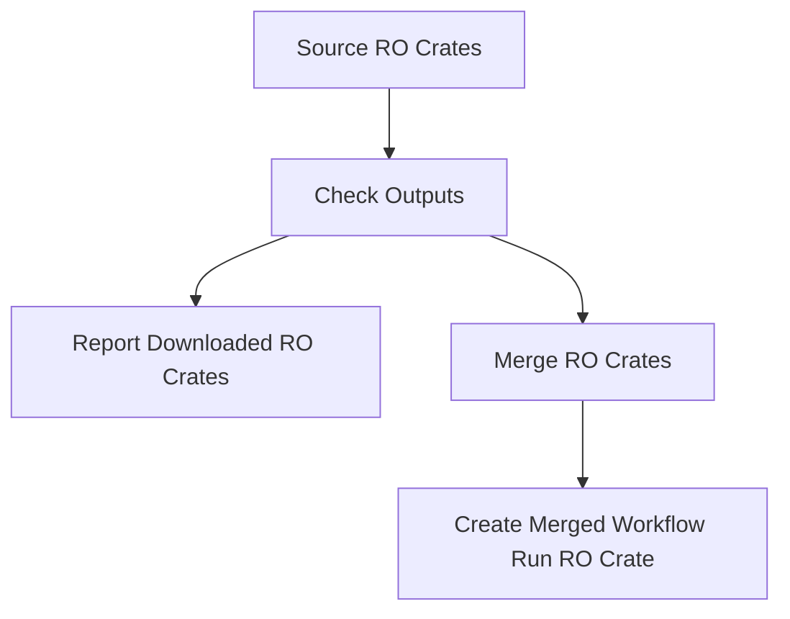

# WorkflowHub Knowledge Graph

A tool to generate a knowledge graph from a source of RO Crates. By default, this tool sources and generates an RDF graph of crates from [WorkflowHub](https://workflowhub.eu/). 

## Getting Started

This tool is run as a Snakemake workflow. We recommend building a Docker container to run the workflow:

```bash 
docker build -t knowledgegraph .
```

Then, you can run the workflow using the following command:

```bash
docker run --rm knowledgegraph --cores 4 -s /app/Snakefile
```

This command runs a Docker container using the `knowledgegraph` image. It mounts the working directory to `/app` 
inside the container, sets `/app` as the working directory, and then runs the workflow. Once the workflow completes, 
the container is automatically removed.

## Structure



- **`source_ro_crates`**: This rule sources RO crates from the WorkflowHub API (`source_crates.py`) and then checks 
the output (`check_outputs.py`). This generates a list of expected file paths based on the workflow IDs and versions to 
facilitate the workflow.

- **`report_created_files`**: Optional. This rule reports the downloaded RO crates to the user.
- **`merge_files`**: This rule merges the downloaded RO crates into a single RDF graph (`merge_ro_crates.py`).
- **`create_ro_crate`**: This rule creates a merged workflow run RO crate from the merged RDF graph (`create_ro_crate.py`).

## Contributing

### Coding Style

- **Code Formatting**: We use [Python Black](https://black.readthedocs.io/en/stable/) for code formatting. Please format your code using Black before submitting a pull request (PR)
- **Type Hinting**: Please use type hints ([PEP 484](https://www.python.org/dev/peps/pep-0484/)), and docstrings ([PEP 257](https://www.python.org/dev/peps/pep-0257/)) in methods and classes.

### Branching Strategy

- **Branch Naming**: When working on a new feature or bug fix, create a branch from `develop`. e.g. `feature/description` or `bugfix/description`.
- **Development Branch**: The `develop` branch is currently our main integration branch. Features and fixes should target `develop` through PRs.
- **Feature Branches**: These feature branches should be short-lived and focused. Once done, please create a pull request to merge it into `develop`.

## License

[BSD 2-Clause License](https://opensource.org/license/bsd-2-clause)
